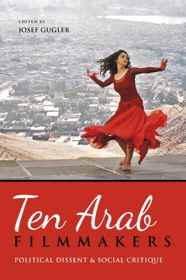

كتاب
[Ten Arab Filmmakers: Political Dissent and Social
Critique](https://iupress.org/9780253016522/ten-arab-filmmakers/)
هو عمل جماعي عن مخرجين سينمائيين عرب تعبر أفلامهم عن
مواقف نقدية من الواقع الاجتماعي. يتضمن الكتاب
[فصلاً لي](https://edoc.unibas.ch/61090/)
(وهو متوفر عن طريق الوصول الحر)
عن الطرق التي استطاع بها المخرج المصري يسري نصر الله احتلال موقع مستقل إلى حد
كبير في الحقل السينمائي.

