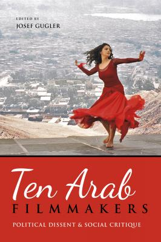

[Ten Arab Filmmakers: Political Dissent and Social
Critique](https://iupress.org/9780253016522/ten-arab-filmmakers/) is
an edited volume about the films and careers of Arab directors whose
films take a critical view of social realities. It includes [a chapter
by me](https://edoc.unibas.ch/61090/) (open access) on how the
Egyptian filmmaker Yousry Nasrallah has succeeded in occupying a
rather autonomous position in the cinematographic field.

